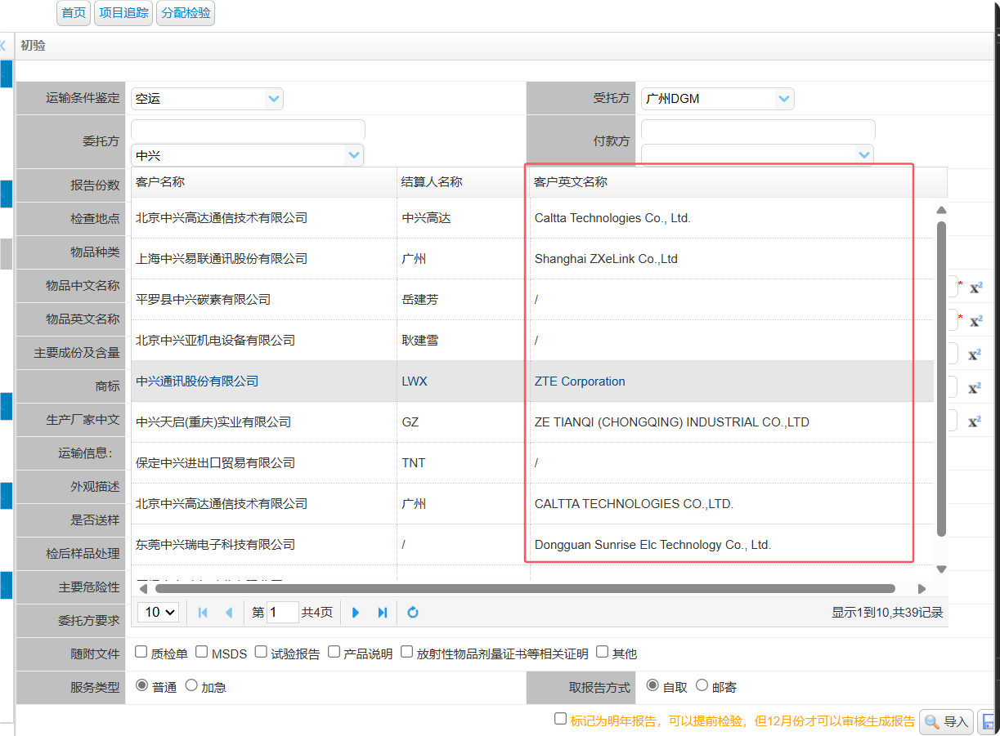
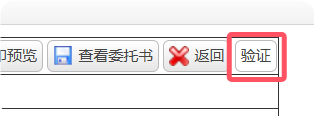
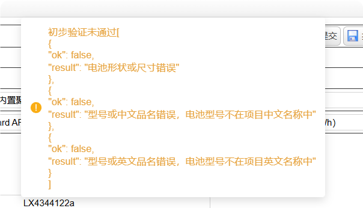
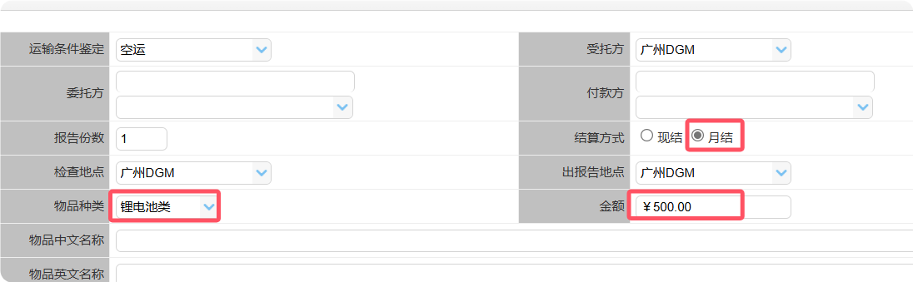
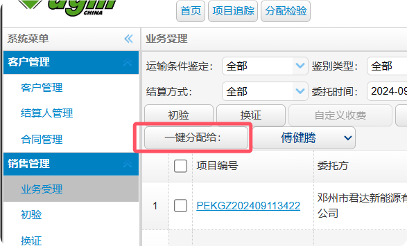
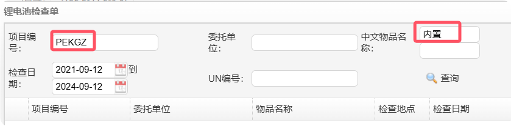
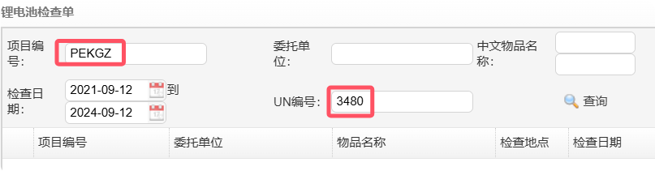
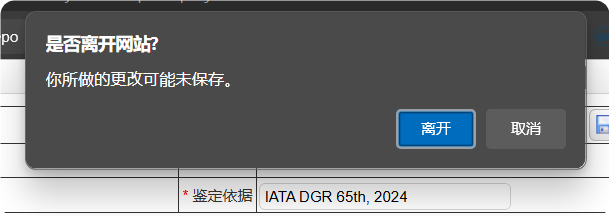

### 快捷键

- 按下 `Ctrl + S` 保存检验单。
- 点击报告编号复制报告编号；或双击 `Ctrl` 键。
- 双击项目中文名称，复制中文名称；或按住 `Ctrl`，双击 `C` 键。
- `Ctrl + D` 在不同页面有不同功能
  - 初验页面列表：刷新列表
  - 样品检验：自动搜索剪切板的项目编号
  - 样品检验列表：刷新列表
  - 初验导入框：自动搜索剪切板的项目编号并导入

### 功能
- 支持显示委托方英文名称

- 自定义图标，用更显眼的图标来区分空海运（默认关闭，需要手动开启）

- 表单验证

- 录入检验单时，会自动将金额设置为500，物品分类设置为锂电池，结算方式改为月结。

- 增加**一键分配按钮**，勾选检验单之后点击一键分配，会直接将检验单分配给主检员。

- 使用报告编号搜索时可以自动删除输入的非法字符，如空格。
- 搜索的报告时，只需要输入编号就能查询，无需输入日期范围。
- 导入检验单时自动设置编号前缀，自动输入搜索词，或UN编号。

- 查询检验单时可以自动设置运输方式。
- 检验单发生改动时，关闭页面将提示未保存，会在标题前面加上星号。
- 标签页面标题显示为项目编号。

- 离开初验页面或样品检验页面一定时间后，返回时自动刷新列表。