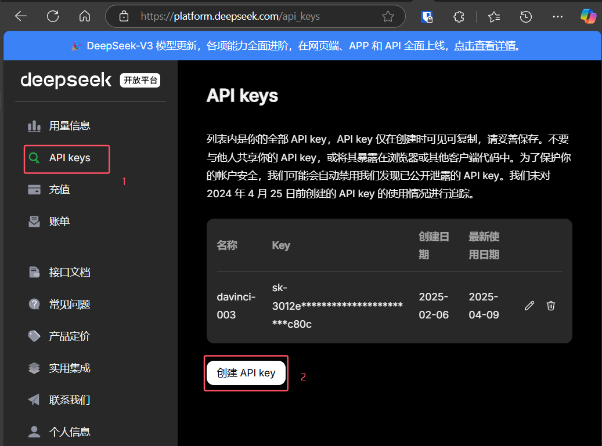
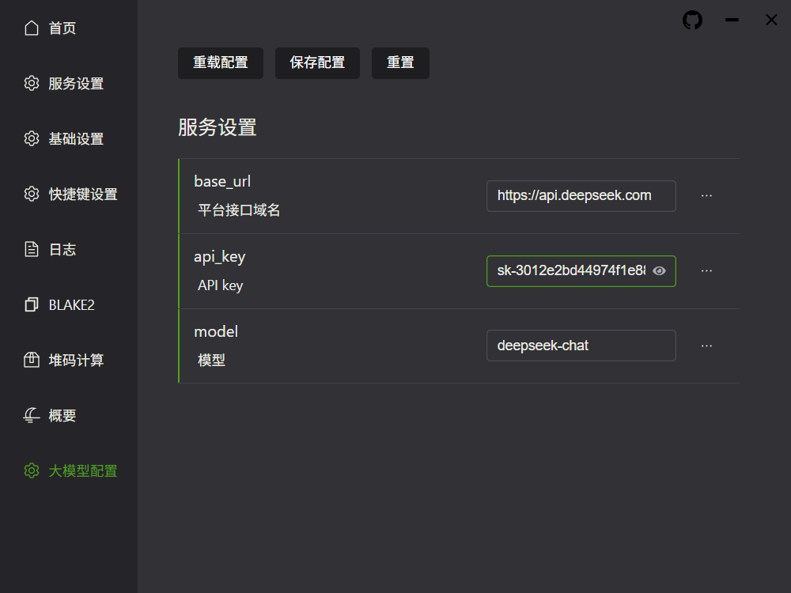

# 验证图片和概要

## 功能介绍

- 通过 `Everything` 工具，搜索图片概要。
- 再调用解析器读取图片概要，与系统检验单进行匹配。

## 前置条件

- 安装解析器。
  - 方法一：安装图形化界面。
  - 方法二：直接运行可执行文件。
- 设置 `Everything` 服务。
- `v1.8.9` 以上版本的 `lims` 插件 。

## 安装

### 方法一：安装 tauri 版本。

::: warning
此版本内存占用低性能高，但兼容性不足，如果安装后无法打开，请尝试方法二。
:::

[点我下载](https://github.com/initialencounter/Aircraft/releases/download/v0.6.0/aircraft_0.6.0_x64_zh-CN.msi)

1. 退出所有杀毒软件
2. 双击安装包，进行安装。
3. 安装完成后，双击桌面快捷方式 `aircraft` ，运行程序。

### 方法二：安装 electron 版本。

[点我下载](https://github.com/initialencounter/Aircraft/releases/download/v0.6.0/aircraft_0.6.0_electron_x64-setup.exe)

1. 双击安装程序，进行安装。

### 设置 Everything 服务

1. 打开 `Everything` 选项。
2. 启用 `HTTP服务器` 。
3. 将 `HTTP服务端口` 设置为 `25456` 。
4. 点击 `应用` 按钮。

### 更新 lims 插件

点击验证按钮，验证图片概要。

## 大模型配置

::: warning
此功能需要 `v2.0.0` 以上版本的 `lims` 插件。
:::

前往[deepseek](https://platform.deepseek.com/api_keys)（推荐）或 [moonshot](https://platform.moonshot.cn/console/api-keys) 开放平台，创建 API-KEY

填入大模型配置，并重载配置

如果是 deepseek 平台申请的 apikey

- 平台接口域名：https://api.deepseek.com
- API key: 申请创建的 APIKEY
- 模型： deepseek-chat
  

如果是 moonshot 则填写

- 平台接口域名：https://api.moonshot.cn/v1
- API key: 申请创建的 APIKEY
- 模型： moonshot-v1-32k

配置好之后将 UN 报告拖入检验单页面，即可让大模型来核对概要与 UN 报告的信息
