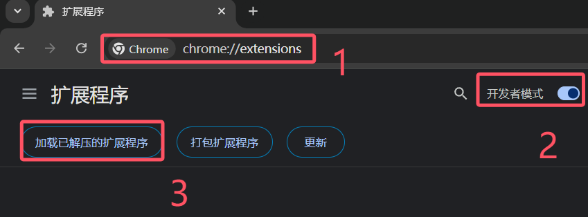

# 快速开始

本章节主要介绍拓展的安装。

## Chrome 系浏览器

以下部分仅适用于 Chrome 系浏览器如：
  - 360浏览器
  - Microsoft Edge
  - Google Chrome

::: warning
目前某些套壳浏览器仅支持临时加载，即退出浏览器后要重新加载，Firefox 浏览器则无此问题，建议迁移到 Firefox 系浏览器。
:::

### 下载并解压拓展
[点我下载](https://ghp.ci/https://github.com/initialencounter/chrome-extensions/releases/download/v2.0.1/lims-v2.0.1.chrome.zip)👈下载地址。

### 安装拓展

- 浏览器地址输入 `chrome://extensions`。
- 打开开发人员模式。
- 加载解压缩的拓展。
- 选择解压后得到的 dist 文件夹。

## Firefox 系浏览器

### 下载并解压拓展

[点我下载](https://ghp.ci/https://github.com/initialencounter/chrome-extensions/releases/download/v2.0.1/lims-v2.0.1.firefox.xpi) 👈下载地址

### 安装拓展

- 浏览器地址输入 `about:addons`。
- 点击齿轮图标。
- 点击从文件安装附加组件。
- 选择文件后缀为 `.xpi` 的文件。

