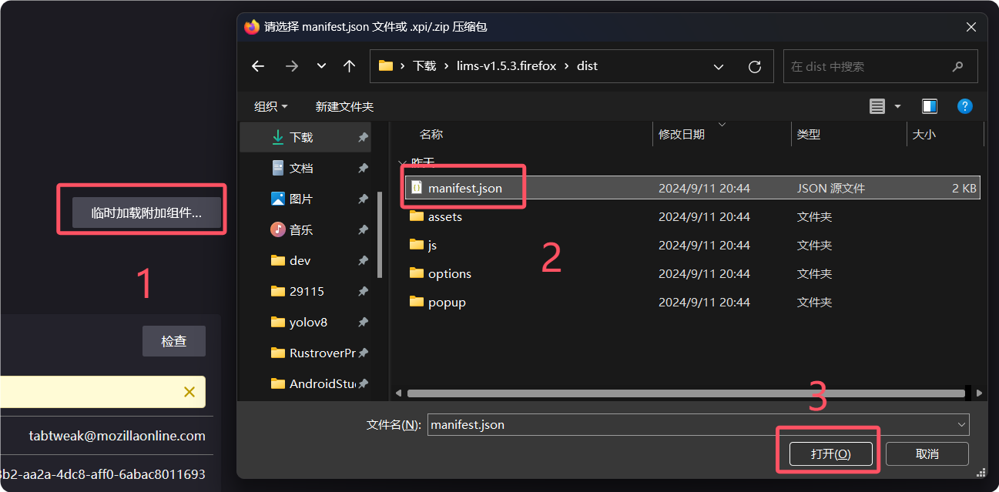

# 快速开始

本章节主要介绍拓展的安装

## Chrome 系浏览器

以下部分仅适用于 Chrome 系浏览器如：
  - 360浏览器
  - Microsoft Edge
  - Google Chrome

### 下载并解压拓展

[点我下载](https://gitee.com/initencunter/chrome-extensions/releases/download/v1.5.4/lims-v1.5.4.chrome.zip)👈下载地址

### 安装拓展

- 浏览器地址输入 `chrome://extensions`。
- 打开开发人员模式。
- 加载解压缩的拓展。
- 选择解压后得到的 dist 文件夹。

  

## Firefox 系浏览器

::: warning
目前 Firefox 系浏览器仅支持临时加载，即退出浏览器后要重新加载，建议迁移到 Chrome 系浏览器
:::

### 下载并解压拓展

[点我下载](https://gitee.com/initencunter/chrome-extensions/releases/download/v1.5.4/lims-v1.5.4.firefox.zip) 👈下载地址

### 安装拓展

- 浏览器地址输入 `about:debugging#/runtime/this-firefox`。
- 点击临时加载附加组件...。
- 加载解压缩的拓展。
- 选择解压后得到的 `manifest.json` 文件。

  
