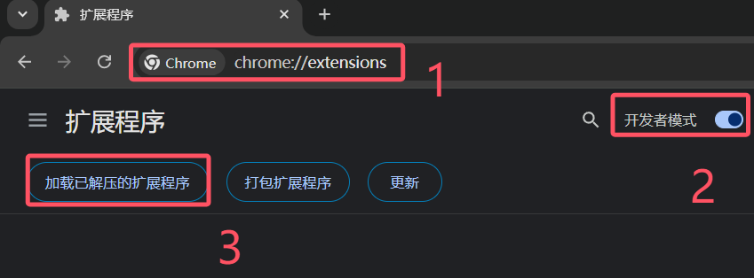

# Lims

## 使用方法

### 加载拓展

#### 下载拓展

- 下载 lims-1.0.0.zip 并解压。

#### 安装拓展

- 浏览器地址输入 `chrome://extensions`。
- 打开开发人员模式。
- 加载解压缩的拓展。
  

- 选择解压后得到的 dist 文件夹。

### 快捷键

- 按下 Ctrl + s 将自动保存。
- 按下 Ctrl + d 将导入剪切板的报告编号。
- 双击 Ctrl 键复制报告编号（点击报告编号也可以获取）。
- 按住 Ctrl，双击 c 键，复制项目中文名称（点击项目中文名称也可以获取）。

### 功能

- 使用报告编号搜索时可以自动删除输入的非法字符，如空格。
- 搜索的报告日期范围会根据输入的编号中的日期来自动设置，无需手动设置日期，前提是这个报告编号是一个完整。
- 打开检查页面的时候，会自动打开一个资料上传页面，无需手动打开。
- 导入检验单时默认查询上一个月从检验的，减少查询时间
- 查询检验单时可以自动设置运输方式
- 检验单发生改动时，关闭页面将提示未保存，会在标题前面加上星号
- 标签页面标题显示为项目编号

## 参考

消息组件[snwjas/Message.js](https://github.com/snwjas/Message.js)
